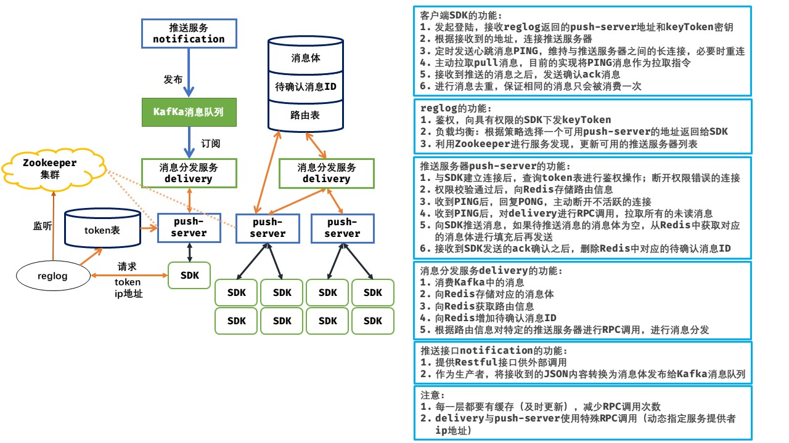

# PigeonPush
Scaled message push service framework. 可扩展消息推送服务框架



## Redis中的数据表
在分析各个模块的功能之前，首先列举需要存储在Redis中供各个模块共用的数据表：
- token表：存储`clientId`与`token`的对应关系
  - 数据结构：字符串类型
  - 键：PIGEON:AUTH:`clientId`
  - 值：token字符串
- 路由表：存储`clientId`与推送服务器地址的对应关系，供消息分发模块向推送服务器下发消息时，确定应该调用推送服务器
  - 数据结构：字符串类型
  - 键：PIGEON:ROUTE:`clientId`
  - 值：对应的推送服务socket器地址
- 待确认消息表：存储`clientId`与未接收到ACK的推送消息`messageId`的对应关系
  - 数据结构：集合类型
  - 键：PIGEON:WAIT_ACK:`clientId`
  - 值：`messageId`集合
- 消息表：存储`messageId`与消息体的对应关系
  - 数据结构：字符串类型
  - 键：PIGEON:MSG_BODY:`messageId`
  - 值：`PushMessage`对象

## pigeonpush-sdk模块
本模块作为客户端SDK使用，使用`okhttp`向route模块发送`HTTP`请求，然后向返回的push-server地址发起`TCP`长连接，主要功能点如下：
- 为了简单起见，将`WIFI`网卡的`MAC`地址作为设备唯一标识符，如果需要改进，可以更改为注册/鉴权模式；
- 客户端通过`okhttp`向route模块发送`HTTP`请求，如果请求成功，route模块将会返回`token`和push-server（推送服务器）地址；如果请求不成功，客户端将会反复发送`HTTP`请求直至成功；
- 客户端获得推送服务器地址之后，随即向服务器发起连接，可能会出现以下几种情形：
  - 连接成功：每次成功建立都要向`Channel`对应的`pipeline`中动态添加鉴权模块`AuthHandler`。然后立即向服务器发送包含有`clientId`和`token`的鉴权请求，如果验证成功则动态删除`AuthHandler`；验证失败则重新向route服务器发起`HTTP`请求；
  ```java
    // 如果成功建立连接，在MessageDecoder之后添加鉴权拦截器AuthHandler用于握手认证
    ChannelPipeline pipeline = client.getFutureChannel().pipeline();
    // 首先验证"AuthHandler"是否存在
    if (pipeline.get(AuthHandler.class) == null) {
      pipeline.addAfter("MessageDecoder", "AuthHandler", new AuthHandler(client));
      log.info(">>>   添加鉴权拦截器AuthHandler   <<<");
    }
  ```
  - 连接失败：按照一定时间间隔，进行重连操作；如果重连次数超过阈值，重新向route服务器发起`HTTP`请求；
 - 如果在一定的时间内，客户端都没有进行写操作（没有接收到信息），则主动向推送服务器发送心跳信息，这么做的目的是为了维持长连接的存活。如果若干次心跳连接都没有收到任何回应，客户端会主动断开连接，开启重连；
 - 接收推送信息：根据用户自定义的方法消费接收到的推送信息。每次消费完消息之后，客户端将会缓存最近消费的100条消息的`messageId`，这样做的目的是为了在客户端层面进行去重，从而彻底避免消息重复消费的现象出现。
 
 ## pigeonpush-reglog模块
 本模块在收到SDK的http连接请求后，会随机产生一个用于后续步骤鉴权的`token`，同时也具有软负载中心的功能，在可用的推送服务器中选择一个返回给SDK。主要有以下两个功能要点：
 - SDK设备对应的`clientId`和`token`将会被成对存储在Redis的**token表**中，在后面的鉴权步骤中，推送服务器将会查询这些数据进行验证；
 - 为了实现软负载中心的功能，采用了Zookeeper作为服务注册中心，每一台推送服务器都是在Zookeeper上注册，reglog模块会监听Zookeeper上服务器的注册路径，从而获取最新准确的推送服务器socket地址列表；
 - 我们使用了改进的一致性哈希算法作为负载均衡算法，这一算法和Redis Cluster所使用的负载均衡算法大体相似，由于这一部分的内容不属于推送系统的模块，在此不做过多叙述，具体可见[源码部分](./pigeonpush-reglog/src/main/java/com/liewmanchoi/service/LoadBalancer.java)。
 
 ## pigeon-server推送服务器模块
 推送服务器模块push-server和消息分发模块delivery同为推送系统的核心的两个模块，它的核心作用是与客户端SDK保持长连接，进行消息的推送与上传，主要功能点如下：
 - 鉴权：每次和SDK建立连接后，都要校验连接权限，具体方法是将SDK上传的`token`与Redis中存储的`token`值进行比对：
    - 如果两者不同，说明没有相应的权限，主动断开连接；
    - 如果两者相同，在路由表和通道关系表中建立对应的表项；
 - 推送消息：接受消息分发模块(delivery)的RPC调用，向SDK推送消息
    - 如果通道关系表中不存在该连接，首先删除对应的表项，然后主动关闭连接;
    - 如果消息体为空，主动向Redis查询`messageId`对应的消息体，填充消息后再进行消息推送；
 - **通道关系表**：由于推送服务器同时连接了大量的SDK，为了在给特定的SDK推送消息时能够找到对应的`Channel`，因此推送服务器使用`HashMap`存储`deviceId`与`Channel`的映射，后文中称之为通道关系表；
 - zookeeper注册：每台推送服务器上线后，都要向Zookeeper集群注册自己，这样reglog模块才能进行负载均衡；
 - 保持长连接：
    - 在接收到SDK发送的`PING`消息后，回复`PONG`；
    - 如果超过一定时间阈值都没有收到SDK的心跳信息`PING`，则主动断开连接，删除token表、通道关系表和路由表中对应的表项；
    - 如果连接被对端(SDK)主动关闭，删除token表、通道关系表和路由表中对应的表项；
 - 接收回执：在接收到SDK发送的ACK消息后，删除Redis**待确认消息**表中的相应记录；
 - 主动拉取消息：接收到SDK发送的`PING`消息后（说明此时连接处于空闲状态），发起对消息分发模块delivery的RPC调用。
 
 ## pigeon-delivery消息分发模块
 消息分发模块delivery是进行消息的推送的中间层，主要作用是保证系统可水平扩展和消息路由，主要功能点如下：
 - 消息消费者：从Kafka消息队列中消费消息；
 - 消息路由：从Kafka中获取到需要推送的消息后，查询Redis中的路由表，确定对应的推送服务器；并且将消息体保存到Redis的消息表中；
 - 消息中转：获取到消息对应的推送服务器之后，RPC调用推送服务器的服务执行消息推送
    - 注意：这里的RPC调用机制比较特殊，每次调用的服务提供者必须是指定的推送服务器，因此需要对Dubbo框架Cluster层进行扩展，具体步骤如下：
      - 每次执行RPC调用，调用推送服务器的推送服务之前，都要把对应的推送服务器（与客户端建立了长连接的推送服务器）的ip地址存入到`RpcContext`中
      ```java
      // 将ip地址放入到RpcContext中，使得Dubbo能够直接调用该推送服务器
      RpcContext.getContext().set("ip", ipAddress);
      ```
      - 然后扩展dubbo的负载均衡机制，使用自定义的负载均衡算法，直接把服务提供者认定为`RpcContext`中ip地址所对应的推送服务器。我们把自定义的负载均衡算法命名为`DirectCluster`，它的核心代码如下：
      ```java
      // 1. 获取设置的ip地址
      String ipAddress = (String) RpcContext.getContext().get("ip");
      // 2.检查是否有可用的invoker
      checkInvokers(invokers, invocation);
      // 3. 根据指定的ip地址获取对应的invoker
      Invoker<T> targetInvoker =
          invokers.stream()
              .filter(invoker -> invoker.getUrl().getHost().equals(ipAddress))
              .findFirst()
              .orElse(null);
      // 4. 发起远程调用
      targetInvoker.invoke(invocation);
      ```
      - 由于dubbo特殊的SPI机制，我们还需要在`resources`目录下新建`MTEA-INF/dubbo`文件夹，加入名为`org.apache.dubbo.rpc.cluster.Cluster`的文件，文件内容为：
      ```properties
      directCluster=com.liewmanchoi.spi.DirectCluster
      ```
 - 建立消息确认机制：每次进行RPC调用前，都会将待发送消息messageID存储到Redis的待确认消息表中，这是消息确认和消息重发机制的基础；
 - 消息重发：推送服务器接收到SDK发送的PING消息时，会远程调用消息分发模块的服务。此时，delivery将从Redis待确认消息表中获取clientID对应的所有未确认消息，然后推送给对应的push-server进行消息下发。
 
 
 ## pigeon-notification消息接入模块
 消息接入模块notification是接收外界消息推送指令的接口，提供Restful API供外部调用，主要功能点如下：
 - web服务器：提供Restful API供外部调用，从而获取需要推送的消息和推送对象
      - POST /v1/push_message
      - JSON格式：
      ```json5
        {
          "cid": ["clientID1", "clientID2", "clientID3"],
          "title": "消息标题",
          "text": "消息正文"
        }   
      ```
- 消息生产者：
  - 接收到消息后，使用`snowflake`算法为消息生成唯一的`messageID`；
  - 将JSON字符串转换为一个或多个`PushMessage`对象；
  - 作为消息生产者，将`PushMessage`对象发送给Kafka消息队列。
   
 
 ## 额外事项：
 - 对象池：由于`Message`对象会在系统中频繁创建与销毁，因此使用Netty自带的对象池能够显著提升系统性能，防止垃圾回收带来的STW(stop the world)停顿
    - 复用reuse时机：
        - 反序列化生成`Message`对象
        - 主动构造`Message`对象
    - 回收recycle时机：
        - 序列化`Message`对象为字节流后
        - `Message`对象已经被使用完成后（比如将`Message`对象转化成`PushMessage`对象后）


## TODO:
- [ ] 设备鉴权模式修改为注册/鉴权模式
- [ ] `HTTP`请求策略修改为失败若干次之后抛出异常 